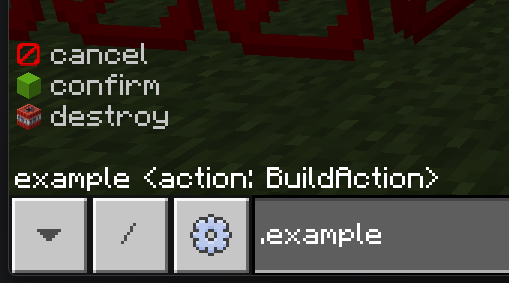

# Creating Commands


## 📜 Overview
- Commands are a way to interact with your plugin through the in-game chat.
- They can be more versatile then a UI and, most importantly, a lot easier and faster to implement.
- In most cases, you won't even need to parse the command arguments yourself, as the API will do it for you.
- You can also create commands that will run on the local server.
- Commands can have multiple overloads, meaning you can have the same command with different parameters.
- Client sided commands can be run anywhere, with the client's prefix.
- Server sided commands can be run when you're hosting a world, the prefix is `/.`


## 🛠️ Creating a Command
- To create a command, you need to create a class that inherits from [OnixCommandBase](xref:OnixRuntime.Api.OnixClient.Commands.OnixCommandBase).
- You'll need to make sure you can construct it outside, you'll be the one constructing it so how you do it is not important to the API.
  - You will need to provide at least a name and description, note that conflicting names are not handled at all as of writing this on the 7th of September, 2025.
  - This is also where you define if the command is client sided, server side or both.
  - You can also provide a permission level, useful for server sided commands, and also for client sided commands if you want to restrict access to certain users.
- Then, create a function and mark it with the [Overload](xref:OnixRuntime.Api.OnixClient.Commands.OnixCommandBase.OverloadAttribute) attribute.
  - Make sure the function returns an [OnixCommandOutput](xref:OnixRuntime.Api.OnixClient.Commands.OnixCommandOutput) for any of its outputs, this lets the API handle it properly for the client and the server.
  - You can use the convenient [Success(string)](xref:OnixRuntime.Api.OnixClient.Commands.OnixCommandBase.Success*) and [Error(String)](xref:OnixRuntime.Api.OnixClient.Commands.OnixCommandBase.Error*) methods in [OnixCommandBase](xref:OnixRuntime.Api.OnixClient.Commands.OnixCommandBase) to create a success or error output quickly.

Here's what it should look like, I explicitly passed in the last two parameters, but you don't have to do that if you want the defaults (client sided, permission level any)
<br>
Now sure, this command doesn't do much, but it should work. We'll expand on it in the next sections.

```csharp
using OnixRuntime.Api.Entities;
using OnixRuntime.Api.OnixClient.Commands;

namespace PluginCommandExample {
    
    public class ExampleCommand : OnixCommandBase {
        public ExampleCommand() : base("example", "A simple example command to show you how they work.", CommandExecutionTarget.Client, CommandPermissionLevel.Any) { }

        [Overload]
        OnixCommandOutput Example() {
            return Success("Hello world!");
        }
    }
}
```

Now, you have a command, how to make it work in game? Simple! We just need to register it when the plugin is loaded with [Onix.Client.CommandRegistry.RegisterCommand](xref:OnixRuntime.Api.OnixClient.Commands.OnixCommandRegistry.RegisterCommand*).
<br>
Note that no cleanup is really necessary, the API will handle it when the plugin is unloaded.
```csharp
// Inside your plugin's main class.
protected override void OnLoaded() {
    Console.WriteLine($"Plugin {CurrentPluginManifest.Name} loaded!");
    Config = new PluginCommandExampleConfig(PluginDisplayModule, true);
    
    // Register our command here!
    Onix.Client.CommandRegistry.RegisterCommand(new ExampleCommand());
}
```
---

## 🧩 Getting Arguments
- Getting arguments is very easy, you just add parameters to your overload function and the API will handle parsing them and calling the function for you.
- For optional arguments, you just need to provide a default value for the parameter, the API will use it if the argument is not provided.
- You can see what [Parameter Types](#-parameters-types) are supported but it's quite straight forward for most of them.
- Let's get some arguments!
```csharp
[Overload]
OnixCommandOutput Example(string name, Block? block = null) {
    return Success($"Hello {name}, do you like {block?.Name ?? "the lack of creativity you have"}?");
}
```
- Now, this command takes a string and an optional block.
- If you run `.example Steve oak_planks`, it will say "Hello Steve, do you like oak_planks?".
  <br><br>
- Now, what if you want to get some more information about the entity running the command?
- Remember those commands have the option to run on the server side or both sides, so you can't just use `Onix.LocalPlayer` and hope for the best.
- Any of the function's parameters can be a [OnixCommandOrigin](xref:OnixRuntime.Api.OnixClient.Commands.OnixCommandOrigin) which will give you more information.
- Note that things are default null in the case the command is ran in the menu or maybe in a command block. (Command blocks are not yet supported but you should check so they don't break if they ever get supported)
```csharp
[Overload]
OnixCommandOutput Example(OnixCommandOrigin origin, BlockPos targetPosition) {
    return Success($"Hello {origin.Entity?.Nametag ?? "Who are you?"}, you are {origin.BlockPosition.Distance(targetPosition)} blocks away from {targetPosition}.");
}
```
- Here we use the origin to get where the command was executed from, and the entity that executed it.
- We no longer need a name parameter as we get it from the entity running the command. For our command that's client only, we know it'll be our local player and we are in a world.
- If you support out of world commands, you should have checks. And you should also check if the entity is not null when on the server side.
---

## ✅ Parameters Types
- There are different types of arguments and specializations for them, here are the currently supported ones.
  - `bool` - A boolean value, can be `true` or `false`.
  - `int` - An integer value, can be any whole number.
  - `float` - A floating point value, can be any number with decimals.
  - `string` - A string value, can be any text, that can also be used with quotes and escape sequences like \n, \" and things like that.
    - Strings have a few specializations:
    - [[RawString]](xref:OnixRuntime.Api.OnixClient.Commands.OnixCommandBase.RawStringAttribute) string - A string that captures everything until the end of the argument list, this will capture EVERYTHING, including spaces and things like that. Make sure it's the last parameter!
    - [[SoftEnumName]](xref:OnixRuntime.Api.OnixClient.Commands.OnixCommandBase.SoftEnumNameAttribute) string - A string that will have recommendations based on a soft enum. See the [Enums Section](#-enums) for more information on this one.
    - [[CommandPath]](xref:OnixRuntime.Api.OnixClient.Commands.CommandPathAttribute) string - This is a string that must be a specific value. If the text the user enters is not the one specified, this overload will be ruled out. This is useful for subcommands.
      - The command path can also specify an item to use as an icon if you're going for something fancy.
  - Entity Types
    - On the client, entities, especially players might not be loaded/out of range so keep that in mind when testing.
    - On the client, when your plugin is not trusted and the user is not either, only the local player is evaluated.
    - Those cases are all handled for you, by giving a no entities found error. Trust is also gracefully handled so no need to worry about it.
    - On the server, do what you want, you're allowed more things, entities will always be loaded and things like that.
      - [Player](xref:OnixRuntime.Api.Entities.Player) - A player entity that is loaded.
      - [Player[]](xref:OnixRuntime.Api.Entities.Player) - One or more player entities that are loaded.
      - [Entity](xref:OnixRuntime.Api.Entities.Entity) - An entity that is loaded.
      - [Entity[]](xref:OnixRuntime.Api.Entities.Entity) - One or more entities that are loaded.
      - [CommandEntitySelector](xref:OnixRuntime.Api.OnixClient.Commands.CommandEntitySelector) - A selector that can be used to discriminate entities manually, having to gather a list of entities yourself. You should avoid this unless you know why you need it.
  - [BlockPos](xref:OnixRuntime.Api.Maths.BlockPos) - A 3D integer position, relative `~` coordinates are supported and automatically handled when using a [Vec3](xref:OnixRuntime.Api.Maths.Vec3).
  - [CommandBlockPosition](xref:OnixRuntime.Api.OnixClient.Commands.CommandBlockPosition) - Same as a BlockPos but you have to calculate the relative coordinates yourself. You should use a [BlockPos].(xref:OnixRuntime.Api.Maths.BlockPos) version unless you know why you need this one.
  - [Vec3](xref:OnixRuntime.Api.Maths.Vec3) - A 3D float position, relative `~` coordinates are supported and automatically handled when using a [BlockPos](xref:OnixRuntime.Api.Maths.BlockPos).
  - [CommandPosition](xref:OnixRuntime.Api.OnixClient.Commands.CommandPosition) - Same as a Vec3 but you have to calculate the relative coordinates yourself. You should use a [Vec3].(xref:OnixRuntime.Api.Maths.Vec3) version unless you know why you need this one.
  - [Vec2](xref:OnixRuntime.Api.Maths.Vec2) - Two floating point numbers. No relative coordinates as what would they even take. This is useful if you need two points that arent an angle (rare, I know).
  - [Angles](xref:OnixRuntime.Api.Maths.Angles) - A pair of yaw and pitch angles, in degrees. This will be useful for the user in intellisense as they will know the yaw/pitch order.
  - [Angles3](xref:OnixRuntime.Api.Maths.Angles3) - A triplet of yaw, pitch and roll angles, in degrees. This will be useful for the user in intellisense as they will know the yaw/pitch/roll order.
  - [Block](xref:OnixRuntime.Api.World.Block) - A block type, this will have intellisense for all the blocks available in the game.
    - The user can specify a state using data by using a comma, like `oak_button,8`.
    - Alternatively, NBT can be used to specify a state too. This will be merged into the default state of the block. Example: `oak_button{button_pressed_bit:1b}`.
    - The user can also specify the whole block using its entire NBT state. Example: `{"name":"minecraft:wooden_button","states":{"button_pressed_bit":1b,"facing_direction":0},"version":15393}`
  - [Item](xref:OnixRuntime.Api.Items.Item) - An item type, this will have intellisense for all the items available in the game.
    - This is just the item type, not a full item stack, so no count, NBT or aux. That is done for [ItemStack](xref:OnixRuntime.Api.Items.ItemStack).
    - You could follow it with a count, aux and NBT parameters to then create an [ItemStack](xref:OnixRuntime.Api.Items.ItemStack).
  - [ItemStack](xref:OnixRuntime.Api.Items.ItemStack) - An item stack with optional aux or nbt.
    - You can specify the aux using a `,` after the name. Example: `stone,1` for granite in older bedrock versions. (not much is using aux anymore, sorry for the lack of practical examples.)
    - Then after the item name and/or aux, you can specify the NBT using `{}`. Example: `diamond_sword{Damage: 542}` for a diamond sword with 542 damage.
    - For the count, you can just add an `int` parameter after and set the count on the item stack yourself.
    - This is convenient as it lets the user give you any item in any stat without you having to provide any extra work.
    - Note that the entire item can be specified as just NBT too.
      - Example: `{"Count":1b,"Damage":0s,"Name":"minecraft:diamond_sword","WasPickedUp":0b,"tag":{"Damage":984,"display":{"Lore":["A sword that has been passed down through generations."],"Name":"§r§bThe Sword of the Ancients"},"ench":[{"id":9s,"lvl":5s}]}}`
      - This gives a diamond sword. A little over halfway used. Named "The Sword of the Ancients" in blue. With lore and enchanted with Sharpness V.
      - And you would have had to zero effort to allow the user to give you that.
  - NBT Types.
    - Those let you get arbitrary NBT data from the user.
    - You can get either an [ArrayListTag](xref:OnixRuntime.Api.NBT.ArrayListTag) or an [ObjectTag](xref:OnixRuntime.Api.NBT.ObjectTag).
    - If you want to support getting both, just take in an [NbtTag](xref:OnixRuntime.Api.NBT.NbtTag) and then check the type at runtime.
    - Here are the supported parameter types:
    - [NbtTag](xref:OnixRuntime.Api.NBT.NbtTag) - Any NBT tag (between Object/Array), you will need to check the type at runtime.
    - [ObjectTag](xref:OnixRuntime.Api.NBT.ObjectTag) - An NBT object, must start and end with `{}`.
    - [ArrayListTag](xref:OnixRuntime.Api.NBT.ArrayListTag) - An NBT array, must start and end with `[]`.
  - Enum Types
    - Soft Enums
      - I will talk more about those in the [Enums Section](#-enums).
    - Enums
      - Those are your normal C# enums.
      - You can put any enum you want as a parameter and the API will handle parsing it for you.
      - Names are automatically converted to `snake_case` for the user, so `MyEnumValue` becomes `my_enum_value`.
      - Normal enums get registered in the registry automatically so you don't have to do anything special for them to work.
      - I will talk some more about those in the [Enums Section](#-enums).
        <br><br>
- So those are the types that you can use as parameters, I know it's a bit much but all the info is there.

---

## 📃 Enums
- Anything related to enums is stored in the [CommandEnumRegistry](xref:OnixRuntime.Api.OnixClient.Commands.CommandEnumRegistry).
- Note that the names only have to be unique per plugin, so name them cleanly and don't worry about conflicts with other plugins.
### ⭐ Enums are a special type of parameter that lets you get a value from a predefined set of values.
- Enums are registered automatically in the parameters so you shouldn't have to manually register them in the [CommandEnumRegistry](xref:OnixRuntime.Api.OnixClient.Commands.CommandEnumRegistry).
- Enums use normal C# enums so you can use any enum you want.
- Enum names are automatically converted to `snake_case` for the user, so `MyEnumValue` becomes `my_enum_value`.
- If you want to specify a different name for the user to type in, you can use the [[CommandEnumName]](xref:OnixRuntime.Api.OnixClient.Commands.CommandEnumNameAttribute).
- If you want that value to have an item for its icon, use a [[CommandEnumIconAttribute]](xref:OnixRuntime.Api.OnixClient.Commands.CommandEnumIconAttribute).
- Here is an example enum that uses those attributes, note that those attributes are optional:
```csharp
public enum BuildAction {
    [CommandEnumIcon("tnt")]
    [CommandEnumName("destroy")]
    Explode,
    [CommandEnumIcon("lime_concrete")]
    Confirm,
    [CommandEnumIcon("barrier")]
    Cancel
}

[Overload]
OnixCommandOutput Example(OnixCommandOrigin origin, BuildAction action) {
    return Success($"Yeah man, I'll {action} soon...");
}
```
Here is what it looks like in game:


### SoftEnums are a recommendation in the auto complete, it holds no weight and the user can enter any string they want.
- They will be synced automatically between the client and server.
- You can add/remove/re-register values at any time, they will be updated automatically.
- You can have icons for them too, just like normal enums.
- This is useful for data that you get at runtime only.
- Those are not registered automatically, you need to register them yourself in the [CommandEnumRegistry](xref:OnixRuntime.Api.OnixClient.Commands.CommandEnumRegistry).
  - You can call this in your plugin's `OnLoaded()` method or the command's constructor, if it's that specific.
  - [RegisterSoftEnum()](xref:OnixRuntime.Api.OnixClient.Commands.CommandEnumRegistry.RegisterSoftEnum*) is the method to use to set an entire list of values.
  - [AddSoftEnumValue()](xref:OnixRuntime.Api.OnixClient.Commands.CommandEnumRegistry.AddSoftEnumValue*) is the method to use to add a single value.
  - [RemoveSoftEnumValue()](xref:OnixRuntime.Api.OnixClient.Commands.CommandEnumRegistry.RemoveSoftEnumValue*) is the method to use to remove a single value.
- Here is an example of registering a soft enum:
```csharp
protected override void OnLoaded() {
    Console.WriteLine($"Plugin {CurrentPluginManifest.Name} loaded!");
    Config = new PluginCommandExampleConfig(PluginDisplayModule, true);
    
    Onix.Client.CommandRegistry.RegisterCommand(new ExampleCommand());
    
    string notesDirectory = Path.Combine(PluginPersistentDataPath, "Notes");
    if (!Directory.Exists(notesDirectory))
        Directory.CreateDirectory(notesDirectory);
    CommandEnumRegistry.RegisterSoftEnum("Note", Directory.GetFiles(notesDirectory).Select(Path.GetFileNameWithoutExtension)!);
}
```
We read all the files in a directory and register them as a soft enum called "Note".

---

## 🛰️ Server Sided Commands
- Server sided commands can be run when you're hosting a world, the prefix is `/.`.
- Anyone in the world can run them, so make sure to set the permission level properly.
- You can have a specific overload be just for the server side by specifying it in the [[Overload]](xref:OnixRuntime.Api.OnixClient.Commands.OnixCommandBase.OverloadAttribute) attribute.
```csharp
public class ExampleCommand : OnixCommandBase {
    public ExampleCommand() : base("example", "A simple example command to show you how they work.", CommandExecutionTarget.Server, CommandPermissionLevel.Any) { }

    
    [Overload]
    OnixCommandOutput Exterminate(OnixCommandOrigin origin, Entity[] entities, bool allowSuicide = false) {
        int count = 0;
        foreach (Entity entity in entities) {
            if (entity is Entity {IsAlive:true}) {
                if (!allowSuicide && entity == origin.Entity)
                    continue;
                entity.Kill();
                count++;
            }
        }
        return Success($"{count} entities were exterminated. (Reference???)");
    }
}
```
- In this example, we changed our command to be server only and added an overload that takes in entities and kills them.
- If we wanted a client sided version too, we could specify which side the overload is for.
- There is an optional bool for allowing the player to kill themselves, which is false by default.

---

## 🔄 Hybrid Commands (Client and Server)
- You can have a command that works on both the client and server side by specifying `CommandExecutionTarget.Both` in the constructor.
- Then, you can have overloads that are client only, server only or both.
- You can also have overloads that do both if they can work on both sides.
```csharp
public class ExampleCommand : OnixCommandBase {
    public ExampleCommand() : base("example", "A simple example command to show you how they work.", CommandExecutionTarget.Both, CommandPermissionLevel.Any) { }

    // If we're running it as a server command, kill every entity in the list that is alive.
    [Overload(CommandExecutionTarget.Server)]
    OnixCommandOutput Exterminate(OnixCommandOrigin origin, Entity[] entities, bool allowSuicide = false) {
        int count = 0;
        foreach (Entity entity in entities) {
            if (entity is Entity {IsAlive:true}) {
                if (!allowSuicide && entity == origin.Entity)
                    continue;
                entity.Kill();
                count++;
            }
        }
        return Success($"{count} entities were exterminated.");
        
    }
    // When running from the client, we can just say how many entities matched on the client side.
    // This is useless but for demonstration purposes, it's fine.
    [Overload(CommandExecutionTarget.Client)]
    OnixCommandOutput ListEntities(OnixCommandOrigin origin, Entity[] entities, bool allowSelf = false) {
        return Success($"{entities.Length} entities have been selected.");
    }

    // Not specifying a target means any, note that this won't expand the command's execution target.
    // out of world gets ruled out automatically when things like entities, blocks or items are in the parameters.
    [Overload]
    OnixCommandOutput Teleport(OnixCommandOrigin origin, BlockPos position) {
        if (origin.IsClientSide) {
            Onix.Game.ExecuteCommand($"/tp @s {position}");
            return Success(""); // empty string means no output from us as the game will do that when executing the /tp command.
        } else if (origin.IsEntity) {
            origin.Entity!.Position = position.Center.WithY(position.Y);
            return Success($"Teleported to {position}."); // server side feedback, since we dont use /tp here, this is the only feedback.
        } 
        return Error("Could not teleport you, you don't seem to be an entity.");
    }
}

```

---

## 📂 Sub Commands
- You can easily create sub commands using the [[CommandPath]](xref:OnixRuntime.Api.OnixClient.Commands.CommandPathAttribute) attribute.
- Simply add the attribute in front of a string parameter and set the value to what you want the user to type.
- If the user types anything else, this overload will be ruled out and not executed.
- Here is an example of a command with sub commands:
```csharp
public class NotesCommand : OnixCommandBase {
    public NotesCommand() : base("notes", "Allows you to store and retrieve notes.") {
        CommandEnumRegistry.RegisterSoftEnum("Note", Directory.GetFiles(GetNotesDirectory()).Select(Path.GetFileNameWithoutExtension)!);
    }

    string GetNotesDirectory() {
        string notesDirectory = Path.Combine(PluginCommandExample.Instance.PluginPersistentDataPath, "Notes");
        if (!Directory.Exists(notesDirectory))
            Directory.CreateDirectory(notesDirectory);
        return notesDirectory;
    }
    public string GetNotePath(string title) {
        string notesDirectory = GetNotesDirectory();
        foreach (var c in Path.GetInvalidFileNameChars()) {
            title = title.Replace(c, '_');
        }
        return Path.Combine(notesDirectory, $"{title}.txt");
    }
    
    [Overload]
    OnixCommandOutput AddNote(OnixCommandOrigin origin, [CommandPath("add")] string addPath, string title, string content) {
        string filePath = GetNotePath(title);
        if (File.Exists(filePath))
            return Error("A note with that title already exists.");
        File.WriteAllText(filePath, content);
        CommandEnumRegistry.AddSoftEnumValue("Note", title);
        return Success($"Note '{title}' added.");
    }
    [Overload]
    OnixCommandOutput RemoveNote(OnixCommandOrigin origin, [CommandPath("remove")] string removePath, [SoftEnumName("Note")] string title) {
        string filePath = GetNotePath(title);
        if (!File.Exists(filePath))
            return Error("No note with that title exists.");
        File.Delete(filePath);
        CommandEnumRegistry.RemoveSoftEnumValue("Note", title);
        return Success($"Note '{title}' removed.");
    }
    [Overload]
    OnixCommandOutput ViewNote(OnixCommandOrigin origin, [CommandPath("view")] string viewPath, [SoftEnumName("Note")] string title) {
        string filePath = GetNotePath(title);
        if (!File.Exists(filePath))
            return Error("No note with that title exists.");
        string content = File.ReadAllText(filePath);
        return Success($"Note '{title}':\n{content}");
    }

    [Overload]
    OnixCommandOutput ListNotes(OnixCommandOrigin origin, [CommandPath("list")] string listPath) {
        var files = Directory.GetFiles(GetNotesDirectory());
        if (files.Length == 0)
            return Success("No notes available.");
        var titles = files.Select(f => Path.GetFileNameWithoutExtension(f)!);
        return Success("Available notes:\n" + string.Join("\n", titles));
    }
    
}
```
- As you can see, this command lets the user add, remove, view and list notes.
- In the constructor we register the soft enum for the notes, reading all the file names in the notes directory.
- Then we have different overloads that have a different path for each sub command.
- After that, well it's just normal C# and command things!
- Don't forget to register the command in your plugin's `OnLoaded()` method:
```csharp
protected override void OnLoaded() {
    Console.WriteLine($"Plugin {CurrentPluginManifest.Name} loaded!");
    Config = new PluginCommandExampleConfig(PluginDisplayModule, true);
    
    Onix.Client.CommandRegistry.RegisterCommand(new ExampleCommand());
    Onix.Client.CommandRegistry.RegisterCommand(new NotesCommand());
}
```

---
So here you have it, that's how you create commands with varying complexities!