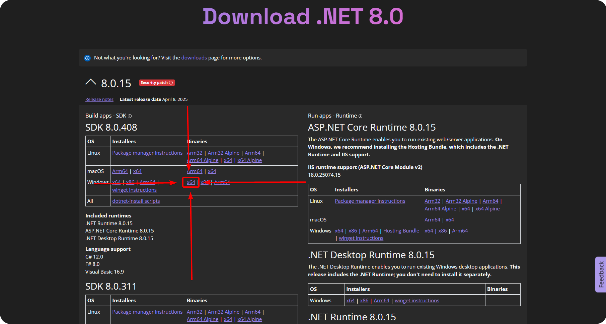

## 🚀 Getting Started
---
### 🛠️ Requirements
- To start developing plugins for Onix Client, you will need the following tools and software. Each section below includes a link to the official download page and a tutorial to help you get set up. 
 
#### 💎 Onix Client Premium
- <a href="https://onixclient.com/buy" target="_blank"><strong>Get Onix Client Premium</strong></a> 
- Required to use the Onix Client Plugin API. 
 
---
#### 🎮 Minecraft: Bedrock Edition
- The game you will be modding so you need to have it installed. 
 
---
#### 🟣 .NET 8.0 SDK
- <a href="https://dotnet.microsoft.com/en-us/download/dotnet/8.0" target="_blank"><strong>Download .NET 8.0 SDK</strong></a> 
    - Download the latest <strong>Windows x64 SDK</strong> in the <strong>Binaries</strong> section. 
    - Extract the downloaded archive, then rename it to `dotnet8` and place the entire `dotnet8` folder (with `dotnet.exe` in its root) into: `%LOCALAPPDATA%\Packages\Microsoft.MinecraftUWP_8wekyb3d8bbwe\RoamingState\OnixClient\Plugins\` 
    - Your folder structure should look like: <code>OnixClient\Plugins\dotnet8\dotnet.exe</code> 
    - <strong>Note:</strong> <code>dotnet.exe</code> is just an example. You must place the entire <code>dotnet8</code> folder (not just the exe) in the Plugins directory. 
 
 
 
---
### 💻 IDE (Integrated Development Environment)
To develop plugins for Onix Client, you will need an IDE to write and compile your code. I would personally recommend using Visual Studio or JetBrains Rider as they are both good IDEs, but it always comes down to personal preference. If your PC struggles to run either, then feel free to use Visual Studio Code, as it's lightweight and only needs a few extensions to work well with C#. 
- <strong>Note:</strong> Make sure to install the C# extension for Visual Studio Code if you choose to use it. 
 
---
#### 🏢 Visual Studio
- <a href="https://visualstudio.microsoft.com/" target="_blank"><strong>Download Visual Studio</strong></a> ([Tutorial](https://learn.microsoft.com/en-us/visualstudio/install/install-visual-studio?view=vs-2022) <a href="https://learn.microsoft.com/en-us/visualstudio/install/install-visual-studio?view=vs-2022" target="_blank">here</a>) 
- A powerful IDE for C# development made by Microsoft. One of their last good products. 
 
---
#### 🦄 JetBrains Rider
- <a href="https://www.jetbrains.com/rider/download/" target="_blank"><strong>Download JetBrains Rider</strong> here</a> 
- A cross-platform C# IDE from JetBrains. Pretty good IDE, I personally use it. It has a lot of features and is very powerful. 
 
---
#### 📝 Visual Studio Code
- <a href="https://code.visualstudio.com/" target="_blank"><strong>Download Visual Studio Code</strong></a> ([Tutorial](https://code.visualstudio.com/docs/setup/setup-overview) <a href="https://code.visualstudio.com/docs/setup/setup-overview" target="_blank">here</a>) 
- A lightweight, cross-platform code editor. Make sure to install the C# extension. I don't personally use it, but it's a good option if you have a low-end PC. 
 
---
### 🧩 Creating Your First Plugin
- To get started with your first plugin, head over to the [Creating Your First Plugin](./creating-your-first-plugin.md) page. It will guide you through the process of creating a simple plugin and give you an overview of the Onix Client Plugin API.
